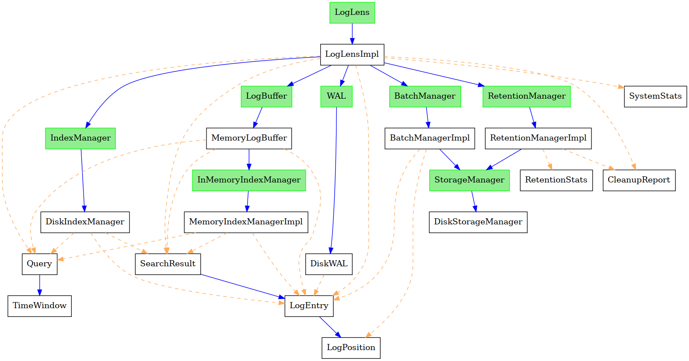

# **LogLens: The Log Gobbler™** 🚀🔥

Bro, your logs are **out of control**? You need **LogLens**, the **lightest, fastest, most sigma log system** out there. 🚀 **It eats logs for breakfast** and spits out **searchable magic.**

💀 **No bloat**
🗿 **No corporate nonsense**
🛫 **Just raw, unfiltered log management power.**

---

## **How It Works (aka the Log Juice Pipeline™) 🏗️**


<small>This text was generated by [GoTypeGraph](https://github.com/hasssanezzz/gotypegraph)
</small>

### 1️⃣ **Log Slurp (Ingestion Pipeline)**
- 📡 **HTTP API**: Yeet logs via `POST` requests.
- 🚀 **Memory Buffer**:
  - Logs chill in **RAM** for **speed**, no slow disk writes 🏎️.
  - **WAL (Write-Ahead Log)** = Logs don’t go **poof** when things crash. 😵‍💫
- 💾 **Batch Flushing**:
  - **2000 logs?** 🚨 **DUMP TO DISK.**
  - **New day?** 🔥 **DUMP TO DISK.**
  - **Compression?** ✅ Zstandard (Zstd) keeps things **thicc but smol.**

### 2️⃣ **Log Parking (Storage)**
- 🏠 **Time-partitioned batch storage**:
  - Your logs live in `/year/month/day` folders 📂.
  - They’re **Zstd-compressed** so your disk doesn’t scream. 😮‍💨
- 📝 **WAL (Write-Ahead Log)**:
  - If LogLens dies, your logs don’t. They **respawn**. 🌀

### 3️⃣ **Log Sniffing (Search & Indexing)**
- 🔍 **Bleve-powered** indexing = **Ultra-fast log searches.** 🏎️
- ⚡ **Parallel indexing**:
  - Logs **ingest first**, index later = **No slowdown.**
- 🧠 **Smart querying**:
  - It checks **both RAM logs + indexed logs** to **find stuff fast.**

### 4️⃣ **Log Yeeting (Retention - Coming Soon™)**
- 🗑️ **Auto-delete old logs** (once we actually implement it). 😭

---

## **Built Different (Tech Stack) 🔧**
🔥 **Bleve** – **Google-level search** for your logs.
🚀 **Zstd** – Compression so good, it should be illegal.
💪 **Concurrency** – We got `sync.RWMutex` & channels like **Goroutines on steroids.**
📅 **Time-Partitioning** – Logs are stored by **date** = **easy cleanup.**

---

## **Why It’s Built Diff™ (Performance Highlights) 🚀**
⚡ **Logs yeet into RAM → Speeds UP.**
🔍 **Search is lightning fast → Indexing GOAT’d.**
💾 **Storage is compressed AF → No more “disk full” meltdowns.**
🧑‍💻 **Minimal setup → Plug. Post. Search. Done.**

---

## **HOW TO SUMMON LOGLENS 👀 (Getting Started) 🛠️**

### **1️⃣ Build it**
```bash
go build ./cmd/main.go
```
### **2️⃣ Run it**
```bash
./main
```
### **3️⃣ Log Spam (POST a Log)**
```bash
curl -X POST -H "KV-environment: production" -H "KV-level: warning" -d "[WARNING] user login failed" http://localhost:8080/
```
### **4️⃣ Stalk Your Logs (Search)**
```bash
curl -X GET -d '{"text": "login", "filters" : { "level": "error", "service": "auth" }}' http://localhost:8080/
```

---

LogLens is ideal for developers needing a simple, self-hosted log solution with minimal setup. Contributions welcome! 🌟
